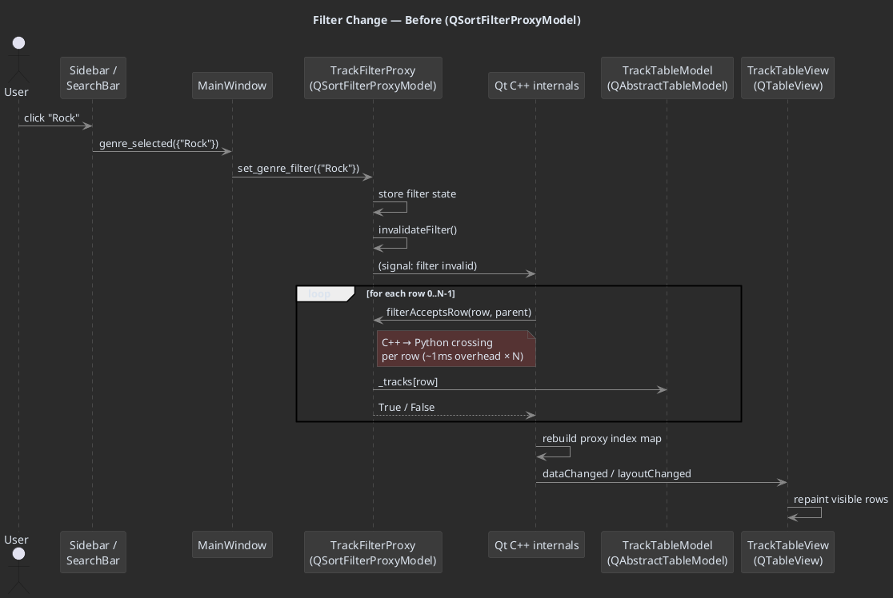
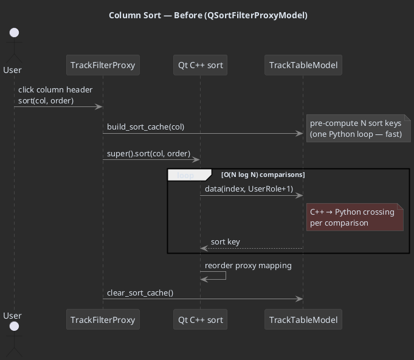
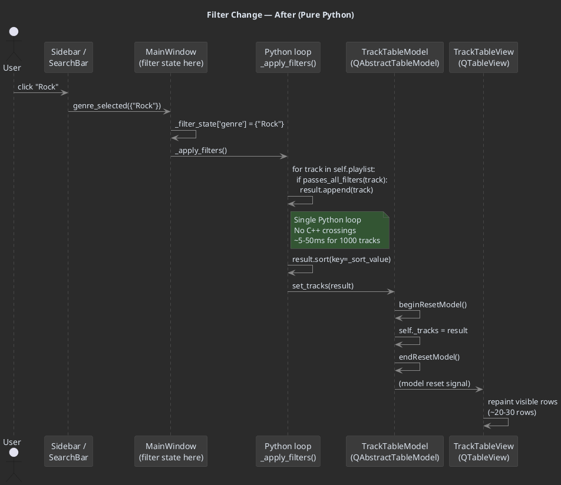
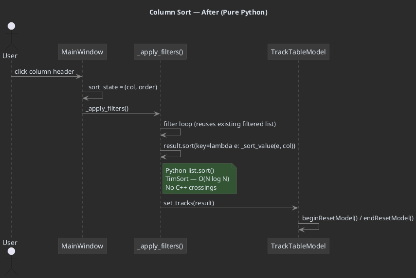
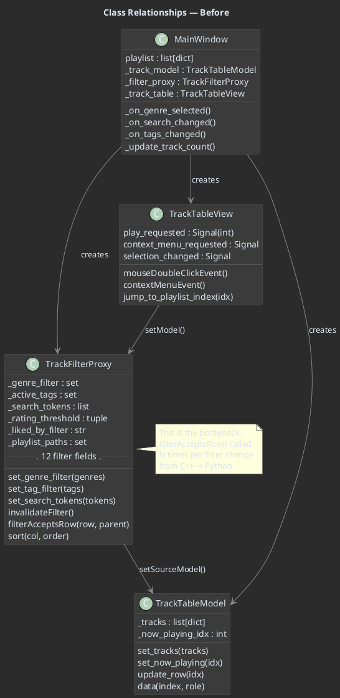
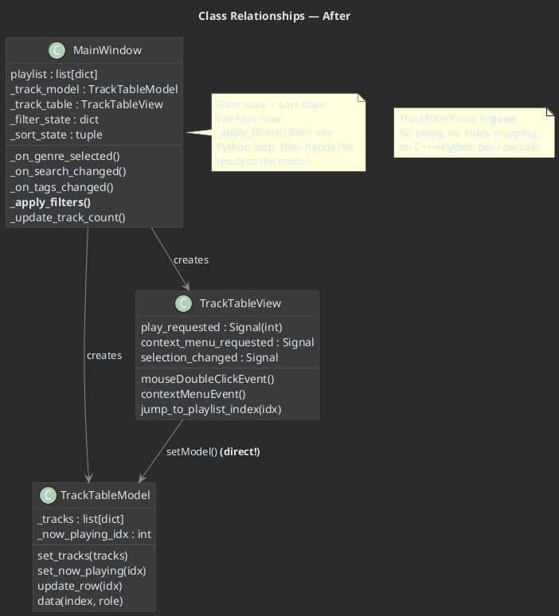

# Filter Refactor Design — Before & After

## Problem

Filtering and sorting the track table takes 500–2,200 ms.  The root cause
is `QSortFilterProxyModel`: every time a filter changes, Qt's C++ side
calls back into Python's `filterAcceptsRow()` once per row in the source
model.  With ~1,000 tracks that's ~1,000 C++→Python boundary crossings,
each with marshalling overhead.  Sorting is the same story — the proxy
calls `lessThan()` or reads `Qt.UserRole+1` O(N log N) times across the
boundary.

## Architecture — Before (Current)

### Data flow

```
                            user clicks
                                │
                                ▼
┌───────────┐  set_genre_filter()  ┌──────────────────┐  invalidateFilter()  ┌─────────────────┐
│ Sidebar / │ ──────────────────▶ │ TrackFilterProxy  │ ◀─────────────────── │ Qt C++ internals│
│ SearchBar │                     │ (QSortFilterProxy │ ──────────────────▶  │ iterates every  │
│ TagBar    │                     │  Model)           │  filterAcceptsRow()  │ source row       │
└───────────┘                     └──────────────────┘  × N rows (Python!)  └─────────────────┘
                                         │
                                         │ setSourceModel()
                                         ▼
                                  ┌──────────────┐
                                  │ TrackTable    │
                                  │ Model         │
                                  │ (QAbstract    │
                                  │  TableModel)  │
                                  │               │
                                  │ ._tracks =    │
                                  │  self.playlist│
                                  └──────────────┘
                                         │
                                         ▼
                                  ┌──────────────┐
                                  │ TrackTable    │
                                  │ View          │
                                  │ (QTableView)  │
                                  └──────────────┘
```

### Object relationships

| Object               | Class                    | Role                                             |
|----------------------|--------------------------|--------------------------------------------------|
| `self.playlist`      | `list[dict]`             | Master list of ALL tracks (never filtered)        |
| `self._track_model`  | `TrackTableModel`        | Wraps `self.playlist` as a QAbstractTableModel    |
| `self._filter_proxy` | `TrackFilterProxy`       | QSortFilterProxyModel — filters + sorts           |
| `self._track_table`  | `TrackTableView`         | QTableView bound to the proxy                     |

### How a filter change works (step by step)

1. User clicks "Rock" in the sidebar
2. `MainWindow._on_genre_selected({"Rock"})` is called
3. It calls `self._filter_proxy.set_genre_filter({"Rock"})`
4. `set_genre_filter()` stores the set, then calls `self.invalidateFilter()`
5. Qt's C++ side iterates every row 0..N-1 in the source model
6. For each row, it calls Python's `filterAcceptsRow(row, parent)`:
   - Checks playlist filter (path membership)
   - Checks genre filter (string comparison)
   - Checks tag filter (set intersection)
   - Checks rating filter (numeric comparison)
   - Checks liked-by filter (set membership)
   - Checks 3 date filters (datetime parsing + comparison)
   - Checks length filter (numeric range)
   - Checks search tokens (string containment)
7. Returns `True` or `False` for each row
8. Qt rebuilds its internal proxy-to-source index mapping
9. The view refreshes

**Cost:** N × (C++→Python crossing + Python filter logic + Python→C++ return)

### How sorting works

1. User clicks a column header
2. `TrackFilterProxy.sort(column, order)` is called
3. It calls `sourceModel().build_sort_cache(column)` to pre-compute sort keys
4. Calls `super().sort(column, order)`
5. Qt's C++ side does a comparison sort, reading `Qt.UserRole+1` from the
   model O(N log N) times — each read crosses the C++→Python boundary
6. Sort cache is cleared

**Cost:** O(N log N) C++→Python crossings

### PlantUML — Before



### PlantUML — Sort (Before)



---

## Architecture — After (Proposed)

### Core idea

Remove `TrackFilterProxy` entirely.  Do all filtering and sorting in a
single Python function, then hand the *already-filtered, already-sorted*
list directly to `TrackTableModel`.  The view sees a flat, final list —
**no proxy, no index mapping, no C++→Python per-row calls**.

### Data flow

```
                            user clicks
                                │
                                ▼
┌───────────┐  _on_genre_selected()  ┌──────────────┐  _apply_filters()  ┌──────────────┐
│ Sidebar / │ ─────────────────────▶ │ MainWindow   │ ────────────────▶  │ Python loop  │
│ SearchBar │                        │              │                    │ over         │
│ TagBar    │                        │ filter state │                    │ self.playlist│
└───────────┘                        │ lives here   │                    │ (pure Python)│
                                     └──────────────┘                    └──────────────┘
                                           │                                    │
                                           │ set_tracks(filtered_sorted_list)   │
                                           ▼                                    │
                                     ┌──────────────┐                           │
                                     │ TrackTable    │  ◀───────────────────────┘
                                     │ Model         │  receives pre-filtered
                                     │ (QAbstract    │  pre-sorted list
                                     │  TableModel)  │
                                     └──────────────┘
                                           │
                                           │ (direct — no proxy)
                                           ▼
                                     ┌──────────────┐
                                     │ TrackTable    │
                                     │ View          │
                                     │ (QTableView)  │
                                     └──────────────┘
```

### Object relationships (after)

| Object               | Class                    | Role                                             |
|----------------------|--------------------------|--------------------------------------------------|
| `self.playlist`      | `list[dict]`             | Master list of ALL tracks (never filtered)        |
| `self._track_model`  | `TrackTableModel`        | Wraps the **filtered+sorted** sublist             |
| ~~`self._filter_proxy`~~ | ~~`TrackFilterProxy`~~ | **REMOVED**                                      |
| `self._track_table`  | `TrackTableView`         | QTableView bound directly to the model            |
| `self._filter_state` | `dict` (new)             | All filter criteria, lives on MainWindow          |
| `self._sort_state`   | `tuple` (new)            | `(column_index, Qt.SortOrder)` or `None`          |

### How a filter change works (step by step)

1. User clicks "Rock" in the sidebar
2. `MainWindow._on_genre_selected({"Rock"})` is called
3. It updates `self._filter_state['genre'] = {"Rock"}`
4. It calls `self._apply_filters()`
5. `_apply_filters()` does ONE Python loop over `self.playlist`:
   - For each track, checks all 12 filter dimensions
   - Survivors go into `filtered = [...]`
6. If a sort column is active, `filtered.sort(key=...)` — pure Python sort
7. Calls `self._track_model.set_tracks(filtered)`
8. `set_tracks()` does `beginResetModel()` / `endResetModel()`
9. Qt repaints only the visible rows

**Cost:** One Python loop (N iterations, no boundary crossings) +
one Python sort (O(N log N), no boundary crossings)

### How sorting works (after)

1. User clicks a column header
2. `MainWindow._on_sort_requested(column, order)` is called
3. It updates `self._sort_state = (column, order)`
4. It calls `self._apply_filters()` (which includes the sort step)
5. Python sorts the already-filtered list with `list.sort(key=...)`
6. Calls `self._track_model.set_tracks(sorted_filtered)`

**Cost:** O(N log N) in pure Python — no C++ crossings at all.

### PlantUML — After



### PlantUML — Sort (After)



---

## Class Diagram — Before vs After

### Before



### After



---

## Index Mapping — Before vs After

This is the core difference and the source of most risk.

### Before: Two-layer index mapping

```
View row 0  ──proxy──▶  Source row 7   ──model──▶  playlist[7]
View row 1  ──proxy──▶  Source row 2   ──model──▶  playlist[2]
View row 2  ──proxy──▶  Source row 15  ──model──▶  playlist[15]
```

- View says "row 0 was double-clicked"
- Proxy maps view row 0 → source row 7
- Model looks up `_tracks[7]` which is `playlist[7]`
- `_playlist_idx` on the entry dict confirms which track it is

The proxy maintains this mapping internally.  It's correct but the
rebuilding cost is what kills performance.

### After: Single-layer, identity mapping

```
View row 0  ──model──▶  _tracks[0]  (which is playlist[7])
View row 1  ──model──▶  _tracks[1]  (which is playlist[2])
View row 2  ──model──▶  _tracks[2]  (which is playlist[15])
```

- View says "row 0 was double-clicked"
- Model looks up `_tracks[0]`
- `_playlist_idx` stored on each entry dict tells us it's `playlist[7]`

There is no proxy mapping.  The model's `_tracks` list IS the filtered+sorted
result.  The `_playlist_idx` field on each entry dict is the **only** link
back to the master `self.playlist`.

### PlantUML — Index Flow

```plantuml
@startuml
skinparam backgroundColor #2b2b2b
skinparam defaultFontColor #dce4ee
skinparam classFontColor #dce4ee
skinparam classBackgroundColor #3b3b3b
skinparam classBorderColor #555555
skinparam arrowColor #888888
skinparam noteBackgroundColor #444444
skinparam noteBorderColor #666666
skinparam noteFontColor #dce4ee

title Double-Click Index Resolution

== Before (with proxy) ==

|View| → "row 0 clicked"
|Proxy| → mapToSource(row 0) → source row 7
|Model| → _tracks[7] → entry dict
|Entry| → entry['_playlist_idx'] → 7

== After (no proxy) ==

|View| → "row 0 clicked"
|Model| → _tracks[0] → entry dict
|Entry| → entry['_playlist_idx'] → 7

note right
    Same result, but simpler.
    The _playlist_idx field on
    each dict is the ground truth.
    This field already exists today.
end note

@enduml
```

---

## What changes in each file

### `ui/track_table.py`

| Item                  | Before                              | After                              |
|-----------------------|-------------------------------------|------------------------------------|
| `TrackFilterProxy`    | ~200 lines, 12 filter setters       | **Deleted entirely**               |
| `TrackTableModel`     | `_tracks = playlist` (full list)    | `_tracks = filtered_sorted` subset |
| `TrackTableView`      | `setModel(proxy)`                   | `setModel(model)` directly         |
| Sort via header click | Proxy intercepts, calls C++ sort    | Signal to MainWindow → Python sort |
| `QSortFilterProxyModel` import | Used                       | **Removed from imports**           |

### `ui/main_window.py`

| Item                       | Before                                    | After                                        |
|----------------------------|-------------------------------------------|----------------------------------------------|
| `self._filter_proxy`       | `TrackFilterProxy` instance               | **Removed**                                  |
| Filter setters             | `self._filter_proxy.set_genre_filter(...)` | `self._filter_state['genre'] = ...`          |
| After setting a filter     | Proxy auto-invalidates                    | Call `self._apply_filters()`                 |
| `_apply_filters()` method  | Does not exist                            | **New** — single loop + sort + set_tracks()  |
| `_update_track_count()`    | `self._filter_proxy.rowCount()`           | `len(self._track_model._tracks)`             |
| `_track_table.setModel()`  | Bound to proxy                            | Bound directly to model                      |
| Sort handling              | Proxy handles it                          | `_on_sort_requested()` sets `_sort_state`    |

---

## Expected Performance

| Operation           | Before (ms) | After (ms) | Speedup |
|---------------------|-------------|------------|---------|
| Filter (1000 tracks)| 500–2,200   | 5–50       | 10–50×  |
| Sort (1000 tracks)  | 2,000–2,500 | 10–30      | 80–100× |
| Poll inner (timer)  | 0.1         | 0.1        | same    |
| Load all tracks     | 30–65       | 30–65      | same    |

---

## Pseudocode for `_apply_filters()`

```python
@perf.track
def _apply_filters(self):
    """Filter + sort self.playlist in pure Python, update the model."""
    fs = self._filter_state
    result = []

    for entry in self.playlist:
        # ── Playlist filter ──
        if fs.get('playlist_paths') is not None:
            if entry['path'] not in fs['playlist_paths']:
                continue

        # ── Genre filter ──
        if fs.get('genre') is not None:
            if entry.get('genre') not in fs['genre']:
                continue

        # ── Tag filter ──
        if fs.get('tags'):
            track_tags = entry.get('tags')
            if not track_tags or not fs['tags'].intersection(track_tags):
                continue

        # ── Rating filter ──
        # ... (same logic as filterAcceptsRow, just inlined)

        # ── Search filter ──
        # ... (same logic)

        result.append(entry)

    # ── Sort ──
    if self._sort_state:
        col, order = self._sort_state
        reverse = (order == Qt.DescendingOrder)
        result.sort(key=lambda e: _sort_value(e, col), reverse=reverse)

    # ── Update model ──
    self._track_model.set_tracks(result)
    self._update_track_count()
```

This is the same logic that's currently in `filterAcceptsRow()`, but
executed as one tight Python loop instead of N C++→Python boundary
crossings.

---

## Rollback plan

If the refactor introduces bugs that are hard to fix:

1. `git stash` or `git checkout -- .` to revert
2. The `TrackFilterProxy` class can be restored from git history
3. The only structural change is removing the proxy — re-adding it is
   a ~10 line change in `main_window.py` + un-deleting the class

The `monolith` branch also preserves the original `player.py` if needed
as an even older reference.
